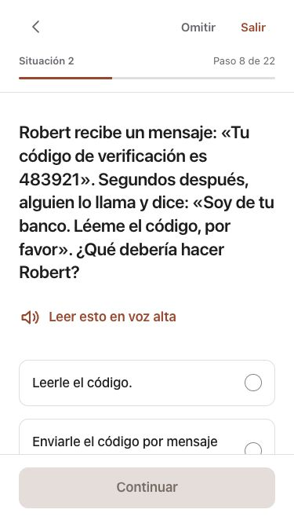
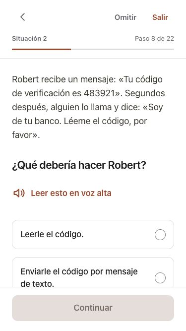

# Clearer scenarios and Spanish account-safety lessons

October 5, 2026. Design follow-through for adults aged 60–80.

Scenarios previously placed the entire story and question in one large heading. All 168 authored scenarios now show the story in readable body text, followed by a distinct question heading. The exact boundaries come from the native curriculum's existing story/question presentation. Tests reconstruct the entire original text; unfamiliar scenarios retain the full original heading. The presentation table is imported by the deferred activity component, leaving canonical curriculum, IDs, scoring and saved progress intact. Spoken text uses the same translated story and question.

Strong Passwords, Password Managers and Two-Factor Authentication now have Spanish reading, practice, quiz, feedback and completion text. Coverage checks all 332 distinct canonical web display strings for those lessons, plus the separate story/question fields. Their navigation titles and badge names are translated. The password builder's existing presentation localization now shows Spanish choices and their matching combined result, while language changes retain canonical selections. Settings and phase two accurately disclose the three translated lessons and remaining English content.

There are 372 new deferred learning translations and 10 interface entries. Existing translations are unchanged. The [shared bilingual review sheet](spanish-account-safety-review.csv) includes native story/question locations as well as the common source fields. Independent editorial/content review remains open.

## Before and after

Both scenario captures use the new Spanish copy; this isolates the hierarchy change. These are built, local component fixtures with real course content and synthetic navigation callbacks.

| Before | After |
| --- | --- |
|  |  |

[Maximum-text scenario](evidence/spanish-account-safety/web-phone-scenario-maximum.jpg), [tablet password builder](evidence/spanish-account-safety/web-ipad-builder.jpg), and [source/capture hashes](evidence/spanish-account-safety/manifest.json).

## Validation

- Final full component run: 2,257 tests passed across 37 files. New checks cover complete lesson copy, distinct choices, exact scenario reconstruction, bilingual hierarchy, unknown-format fallback, canonical scoring, locale-change selection retention and completion copy.
- The initial run caught one obsolete expectation for the language-availability notice; its expected copy was updated, then the final full suite passed. No production failure was hidden by that test adjustment.
- Lint, production web build and whitespace checks passed. Existing chunk-size and ineffective-import warnings remain. Earlier bundle byte counts belong to their original revision; this increment adds deferred content and does not claim measured device speed.
- Browser review covered 375 × 667 phone layouts at standard and maximum text and an 834 × 1210 tablet. The three-question verification activity advanced through correct and incorrect answers; the password builder retained the translated result; scenario choices remained usable. Before/after and enlarged captures were visually inspected.
- Source curriculum files, progress formats and existing translations are unchanged. Native validation is separate and recorded in the Swift repository.

This pass does not complete later-course Spanish, independent language review, all-device/older-browser testing, physical-device performance, actual screen-reader/audio tasks or production service/account/billing acceptance. No deployment or publisher handoff occurred.
