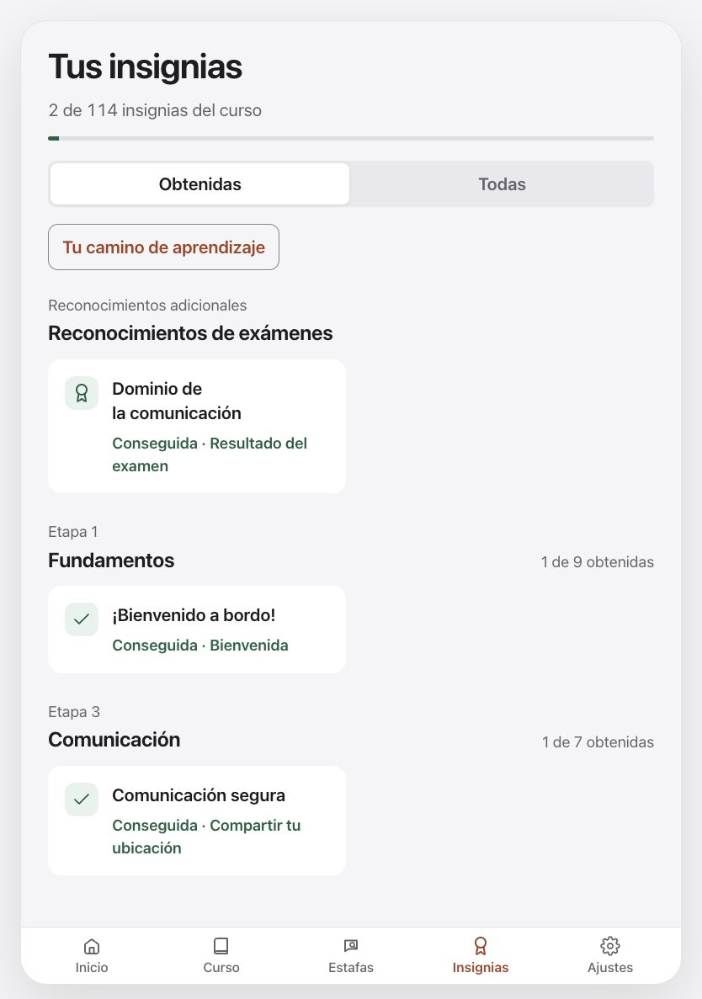
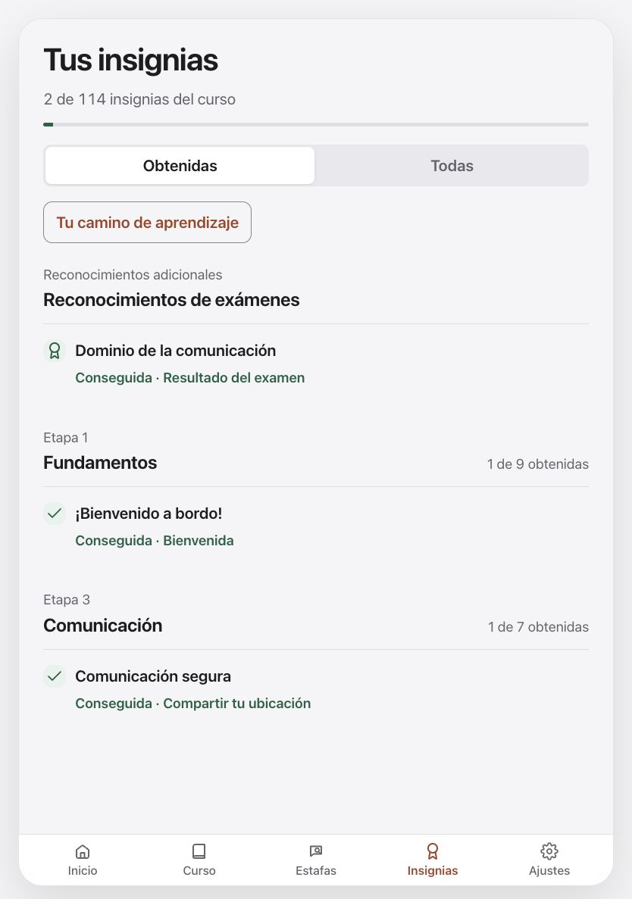
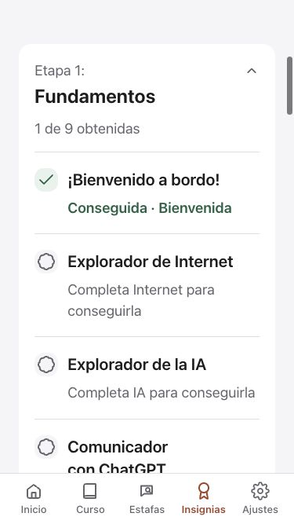
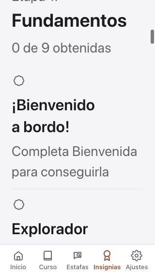

# Clearer achievements for older learners

Achievements now explain the next action: complete the named lesson or pass the exam to earn an award. Earned rows say “Earned” and name the activity. Quiet outline symbols distinguish upcoming awards from completed checkmarks without suggesting the lesson itself is locked. The learning-path button uses the existing guarded navigation route.

All 114 canonical course badge names and their activity labels have Spanish presentation, along with known exam honors. The canonical English award values, course data and stored progress remain unchanged. Unknown legacy honor names still display as stored. This is achievement translation, not a claim that every later lesson is translated.

The tablet earned view now uses aligned, full-width rows with separators. This removes sparse half-width cards and makes titles, statuses and activities easier to scan. Expanded phases keep the same spacing above and below each row. At large reading sizes on narrow screens, the symbol sits above full-width text. Filters, phase expansion and earned counts keep their existing behavior.

[Apple’s labels guidance](https://developer.apple.com/design/human-interface-guidelines/labels) informs clear contextual descriptions; [buttons guidance](https://developer.apple.com/design/human-interface-guidelines/buttons) informs explicit next actions. These are design references, not Apple approval.

## Rendered review

These are development fixtures, not the published app. The tablet comparison captures the intermediate card layout before the final row refinement, with the same Spanish sample awards.

| Tablet before | Tablet after |
| --- | --- |
|  |  |

## Verification

- All **2,324 component checks** passed across 37 files after the final JavaScript and translation changes. New checks cover all 114 canonical names, unchanged stored data, known exam honors, requirements and learning-path callback behavior.
- Final row-spacing CSS was then visually inspected at 375 × 667, 834 × 1194 and maximum app text at 320 × 568. Final lint and production build passed after that adjustment. Existing large-chunk/ineffective-import build warnings remain.
- Added 234 Spanish entries; all 555 previous interface-dictionary entries are unchanged. No curriculum or persisted badge values were changed.
- Earlier Node and browser/paywall suites were not repeated for this presentation increment. Fixtures exercise real components with synthetic progress; they do not validate a production account or payment.

Native companion notes are in EverWise-Swift-app `docs/design/achievement-reading.md`. Later-course Spanish, independent language review, older physical devices, real audio/VoiceOver and production service/purchase acceptance remain open. No deployment or App Store submission was made.
