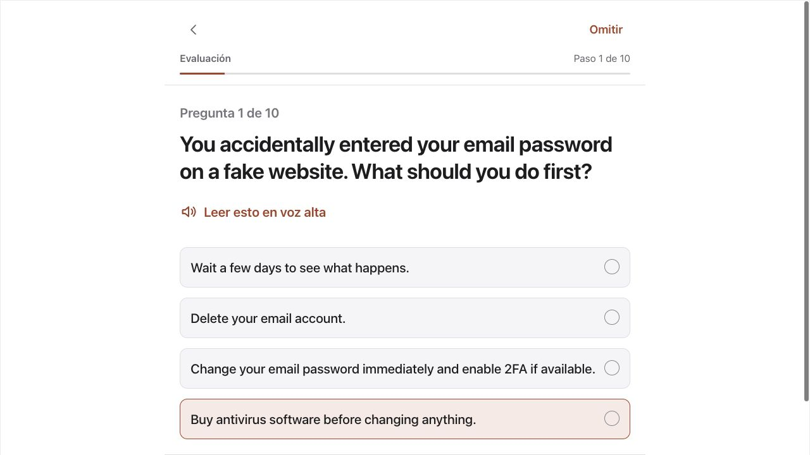
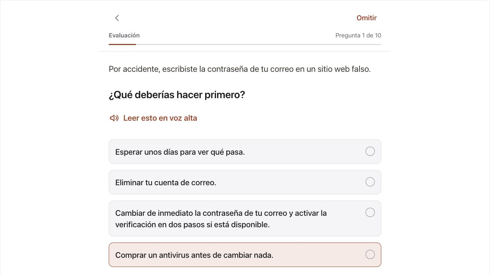
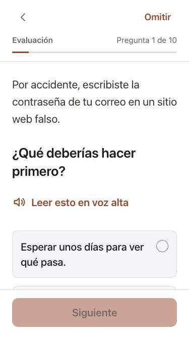
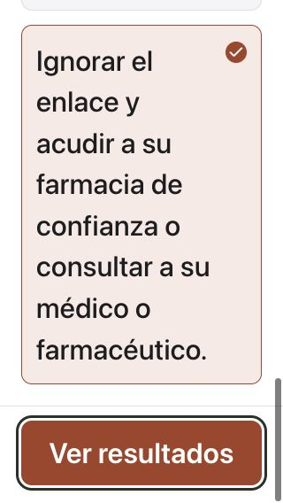
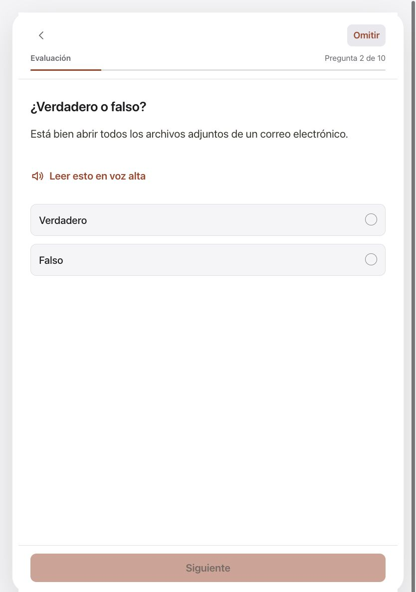
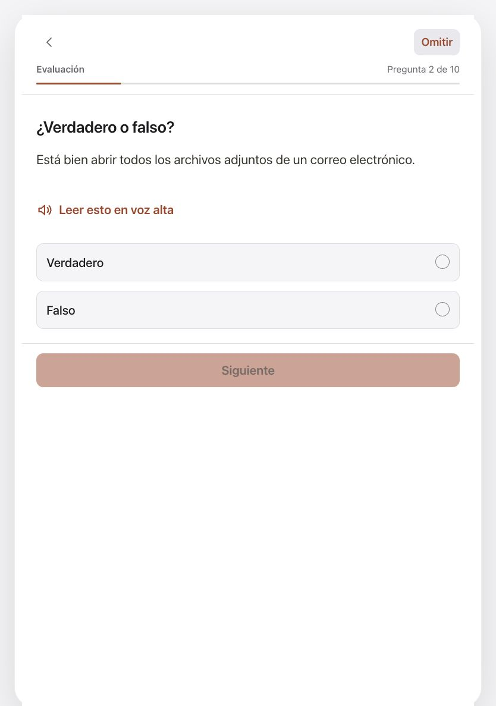
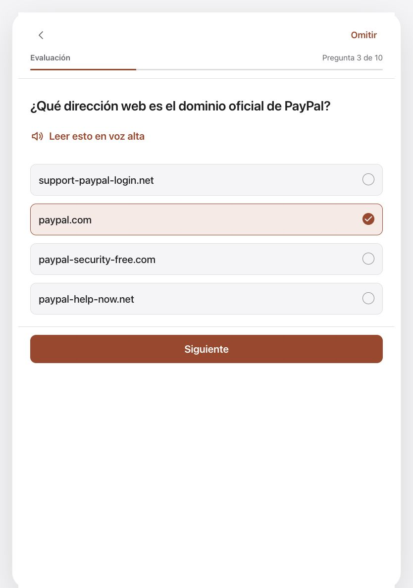
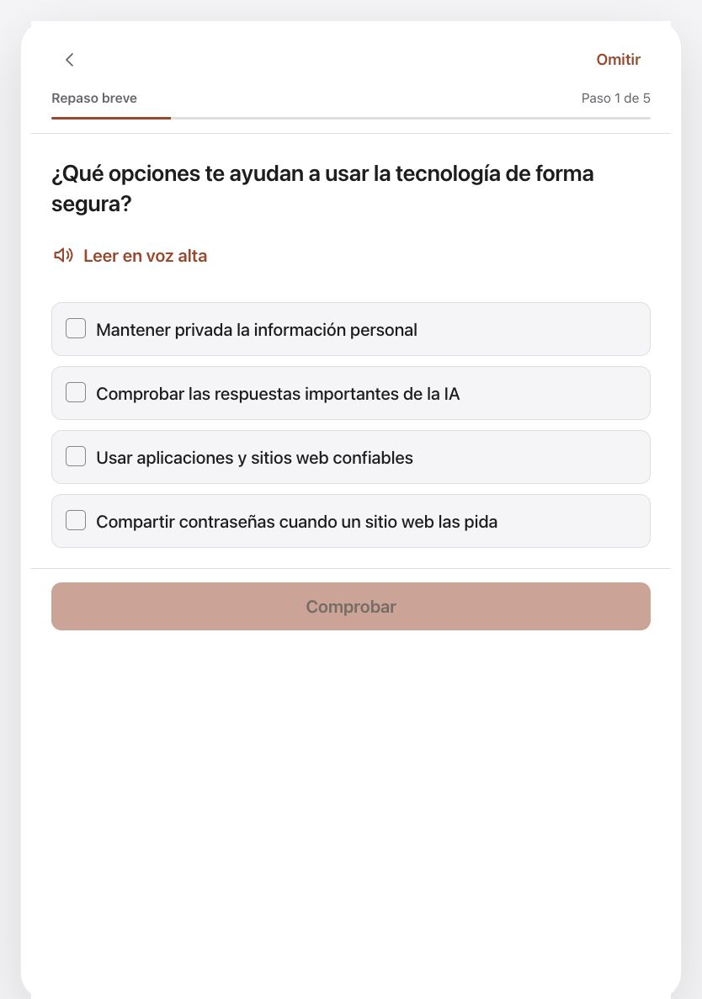

# Readable exams and complete Spanish question copy

All 50 exam questions, every answer choice and the authored explanation strings now have Spanish translations. The display layer adds 236 keys on each platform. Existing translations, canonical curriculum resources, question IDs, option order, correct-answer indices, scoring and persisted progress formats are unchanged. Explanation strings are translated data; this increment does not add an explanation-review screen.

A shared set of 26 display presentations separates situations from the decision, labels true/false tasks before their statements, and supplies a question for four statement-only prompts. Unknown wording falls back to the complete original question. The visible and narrated order agree. A question previously asking which “email address” looked trustworthy now asks which website address is the official PayPal domain; its actual choices are domains. This is a display-only correction with the same options and scoring. PayPal recommends typing its official domain rather than following unexpected links: [PayPal account protection](https://www.paypal.com/us/security/protect-your-account).

The top progress bar says **Question x of y**, replacing competing Step and Question labels. Website domains, password examples and agency abbreviations remain literal. Independent bilingual review and translation of later lessons/challenges remain unfinished.

The tablet learning action now follows the answers in the reading flow, removing the large empty gap before Next. This shared layout was also visually reviewed in a phase-one practice challenge. Phone layouts keep their existing adaptive behavior.

## Rendered review

The before screenshots are earlier development renders, not App Store evidence. The first pair is a 1280 × 720 desktop viewport. Phone captures are 375 × 667 and 320 × 568; tablet captures are 834 × 1187.

| Before | After |
| --- | --- |
|  |  |

| Tablet action before | Tablet action after |
| --- | --- |
|  |  |

## Verification

- 2,322 component checks passed across 37 files after final copy and question-order changes. Coverage includes all 50 rendered Spanish questions/options, literal domains/passwords, canonical selection values, all five exam score boundaries, and existing assessment resume checks. This run preceded the final CSS-only tablet action adjustment.
- Final lint and production build passed after that CSS adjustment; existing large-chunk/ineffective-import warnings remain.
- Browser review exercised all ten phase-seven questions to 10/10 and confirmed one pass callback. It reached the final phase-five answer at 320 × 568 and maximum app text, read its ending, and confirmed 1/10 after nine skips. There was no horizontal page overflow in that checked state.
- The final tablet CSS was visually checked on true/false, domain and phase-one practice screens. These are real components with sample local callbacks; this is not a claim of a full browser suite.
- Canonical data and previous localization entries remain unchanged. Whitespace checks passed. No aggregate browser/paywall tests or fresh non-browser Node suite are claimed for this increment.

## Boundaries

Read-aloud request text and ordering are tested; actual spoken-audio and VoiceOver acceptance remain open. Later lessons/challenges still need Spanish translation and independent language review. Production accounts, purchases, physical devices, launch profiling and release upgrade validation remain separate. The native companion has 28 focused unit checks, two methods on each phone/tablet simulator and a Release build; see its `docs/design/exam-reading.md`.

The hierarchy follows [Apple's layout guidance](https://developer.apple.com/design/human-interface-guidelines/layout). These are implementation checks, not an Apple approval. Source and screenshot hashes are in `evidence/exam-reading/manifest.json`.
