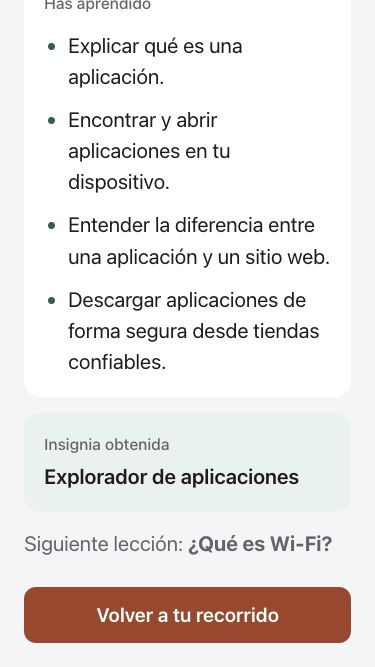
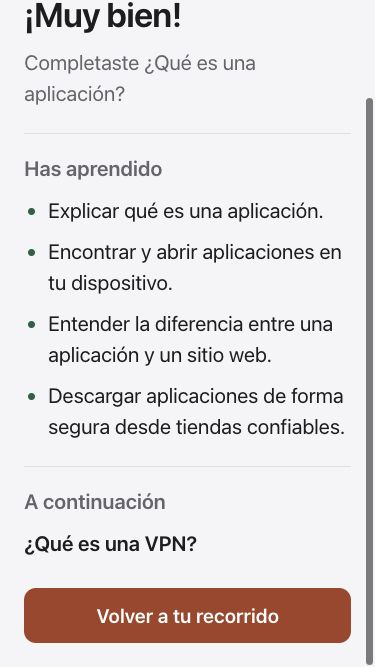
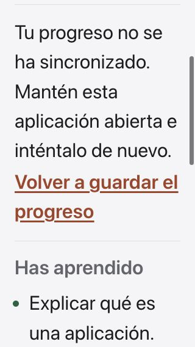
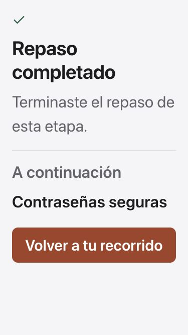
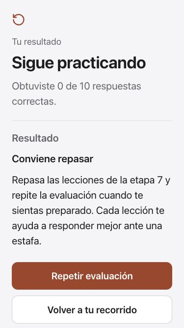
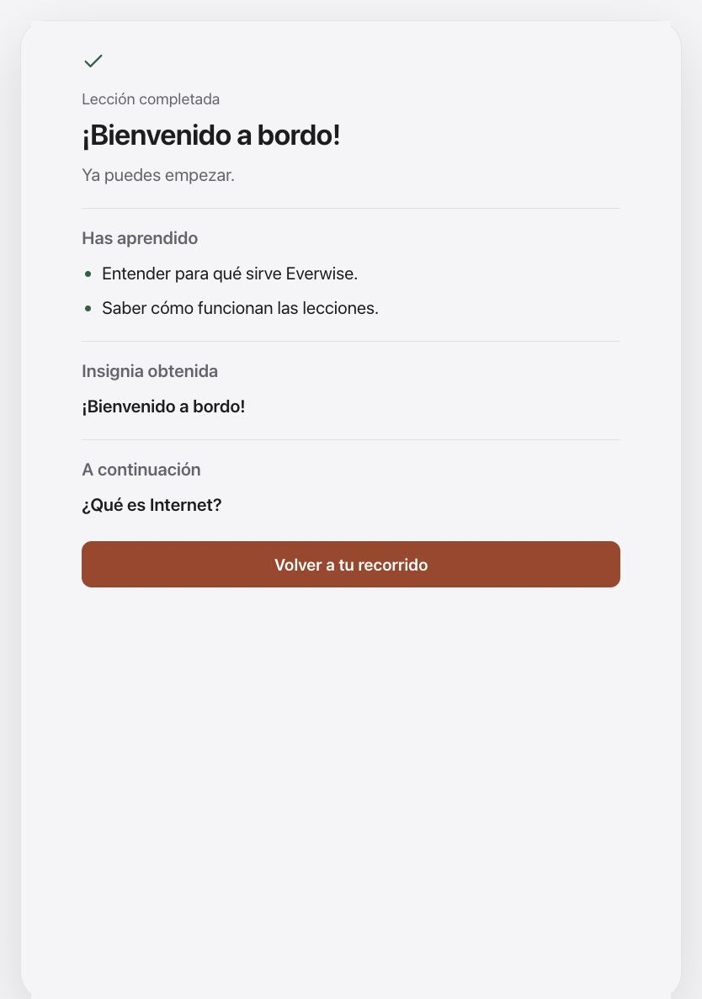

# Clear completion and the next step

The shared lesson, review and exam summaries now use a single reading column, quieter icons, readable section headings and separators in place of nested cards. Actions follow the content. Save recovery appears inside the lesson summary's scroll flow, so it does not consume a separate portion of a small screen at the largest text setting.

The next activity comes from the same ordered curriculum as the learning path. The real **What is an App?** summary previously pointed to Wi-Fi; it now correctly points to **What is a VPN?**. A replay no longer says a badge was newly earned. A first completion shows its award only after the matching account's progress is confirmed; interrupted saving keeps the retry message visible and suppresses the award until recovery.

Exam results distinguish a passing score from a saved achievement. They no longer claim an unpersisted trophy, phase award or unlock before the parent receives the result. The existing score, tier and badge payload is unchanged. Failed attempts offer **Retake exam** and **Back to your path**, independently of whether the exam has a phase badge. Reviews identify the next activity without claiming that the whole course has been completed.

Spanish now covers all five exam introductions, topic lists and result tiers, along with progress-saving messages, score templates and retry controls. This does not complete translation of later-course questions. Canonical activity IDs, answers, scoring and saved-progress formats are unchanged.

## Validation and scope

- The complete component suite passed 2,267 checks across 37 files. The final one-key Exam-label translation was subsequently covered by 49 passing localization checks.
- All 470 non-browser Node checks passed; browser-based paywall tests were excluded from that run and are not claimed.
- Lint and the production build passed. Existing large-chunk and ineffective-import warnings remain.
- Course-order checks cover lessons, phase reviews, exams, unknown IDs and the final activity. App integration checks cover pending and failed saves, successful retry, replay and account changes.
- Browser review covered 375 × 667 and 320 × 568 phones, maximum app text, and an 834 × 1187 tablet capture. The real App lesson, phase-one review and phase-seven exam were exercised with local callbacks. Exam retry returned to question one; the passing result and completed review each called their completion handler once.
- The tablet award capture explicitly simulates an already-confirmed new badge. These fixtures do not establish production account or backend acceptance.

The shared components serve 111 lessons, 17 reviews and five exams; this is not a claim that every screen was individually visually reviewed. Physical devices, actual VoiceOver/audio, remaining Spanish and production release acceptance remain open.

## Rendered comparison

The before images are from the preceding development revision, not the App Store release.

The evidence manifest records source and capture hashes. Native companion work is documented in EverWise-Swift-app at `docs/design/learning-completion.md`.
