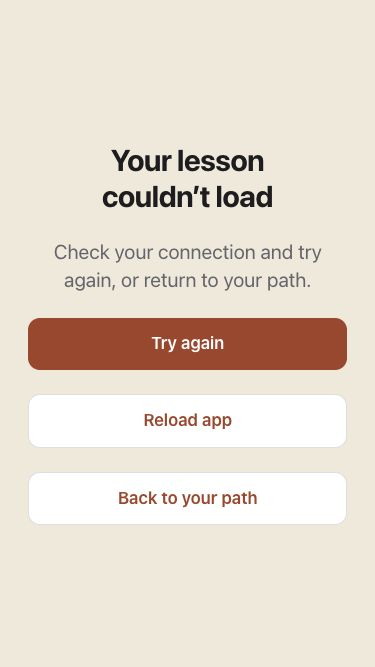
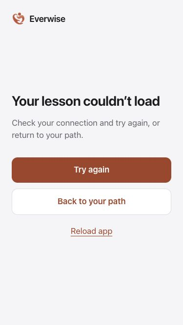
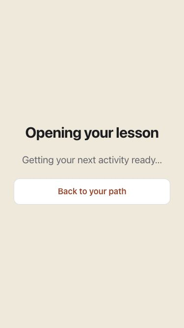
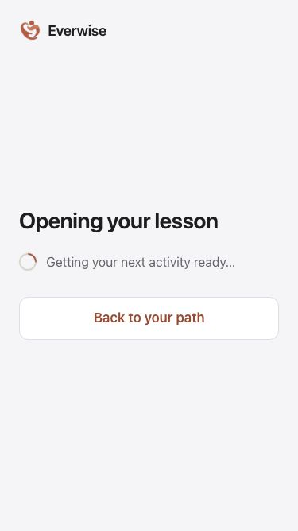

# Lighter learning and clearer recovery — 5 October 2026

Opening any activity previously downloaded the entire curriculum and all players. The runtime now loads the selected phase and player in parallel. The compact set of 17 practice challenges remains a shared download. Completion summaries are deferred too, so their authored copy no longer adds weight to startup.

The loading and error screens now match the app’s neutral surfaces, readable system typography, generous touch targets and clear action hierarchy. An indeterminate indicator explains that content is loading. A stalled download offers a prominent retry, a return to the path and a quieter reload option. Spanish feedback is available. Summary failures explicitly preserve the distinction between a completed lesson and an unavailable summary.

## Measured built JavaScript

Decimal KB; gzip estimates use the same method before and after. Activity values exclude the already-loaded application. These are built-file sizes, not measured network speed or device startup timings.

| Download | Before | After | Estimated gzip before → after |
| --- | ---: | ---: | ---: |
| Initial app JavaScript | 1,071,928 bytes | 1,029,608 bytes | 313,399 → 303,125 bytes |
| First lesson and dependencies | 950,389 bytes | 104,213 bytes | 231,285 → 28,384 bytes |
| First practice and dependencies | 950,389 bytes | 52,528 bytes | 231,285 → 16,138 bytes |
| First exam and dependencies | 950,389 bytes | 79,804 bytes | 231,285 → 22,623 bytes |

The first lesson’s additional JavaScript is about 89% smaller. Each activity dependency graph contains only its selected phase or the shared practice catalog. The dependency file lists and size records are in [the evidence folder](learning-delivery-2026-10-05/). Startup remains large and needs further work.

## Rendered comparison

| Recovery before | Recovery after |
| --- | --- |
|  |  |

| Loading before | Loading after |
| --- | --- |
|  |  |

Screenshots show actual React components. Errors were injected into the isolated fixture; no live account, purchase or progress was changed. The built fixture is a separate QA build and is not included in the production app. The full local gallery also includes tablet practice feedback and completion summary captures.

## Verification

- **2,213 UI/component tests passed** across 36 Vitest files (`npx vitest run --maxWorkers=2`).
- **469 Node tests passed**, running all `.test.js` and `.test.mjs` files except the headless `paywall-layout-browser.test.js`; browser review used Codex computer control separately. An initial aggregate `npm test` run was stopped, not counted as a full-suite pass.
- Focused learning/navigation subset: 292 checks passed. Every lesson, summary, practice and exam was compared deeply against the canonical authored content, including nested answers, explanations, scoring, ordering and next-step labels.
- Regression checks cover delayed and stale phase downloads, 15-second timeout/retry, summary recovery, Spanish feedback, completion persistence and account switching.
- Production build and focused lint passed. Existing large-chunk and ineffective-import warnings remain. The production manifest contains no exercise phase in the initial static dependency graph.
- Built fixture: retry opened the actual welcome lesson; practice graded selected answers; the exam opened its first question; completion showed the authored summary and exited through its return action.
- Visually reviewed 375 × 667 default English, Spanish enlarged text, 320 × 568 at maximum reading size 10, and tablet width 768 × 1024. At the narrow maximum size, the recovery view scrolls with no horizontal document overflow and reachable controls. These are browser dimensions, not physical-device tests.

## Design references and limits

Apple’s [Loading guidance](https://developer.apple.com/design/human-interface-guidelines/loading) supports deferring unnecessary work and keeping waiting screens informative. Its [Progress indicators guidance](https://developer.apple.com/design/human-interface-guidelines/progress-indicators) supports an indeterminate indicator when completion time is unknown. EverWise’s larger reading options and calm recovery hierarchy serve its 60–80 audience; this is not Apple certification.

Curriculum content, scoring, progress semantics, access rules, prices and the connected path are unchanged. Deferred loading is not an offline-download feature. Full Spanish curriculum, physical older iOS/Safari devices, actual VoiceOver usability, production services/purchases and TestFlight upgrade acceptance remain open. This increment changes the web app, not the separate Swift checkout, and has not been deployed or submitted to the App Store.
