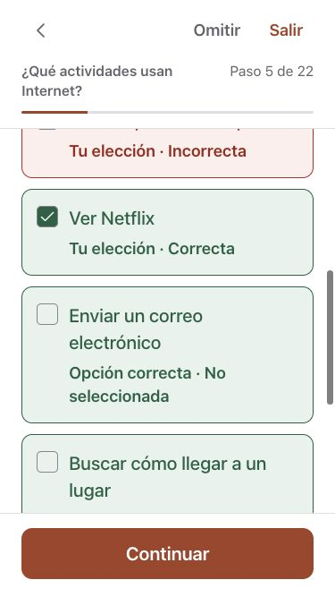
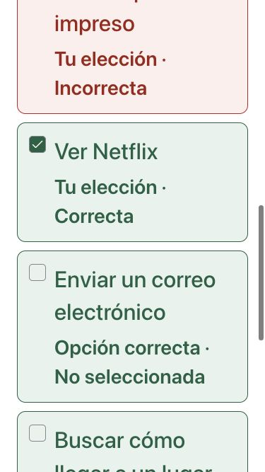
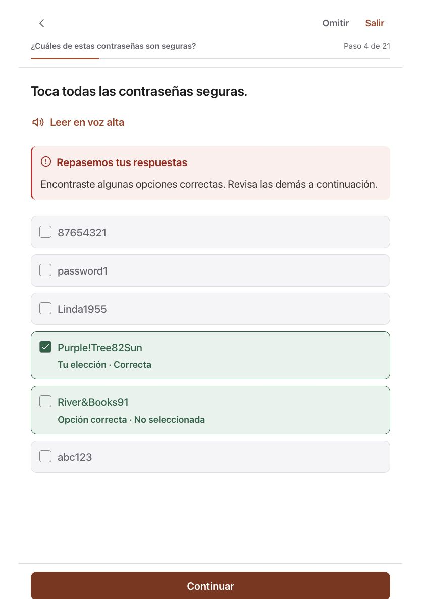

# Multiple-answer review

The original review filled the boxes for every correct answer, including choices the learner had not selected. A long answer list appeared again in the feedback below the options. This made it difficult to distinguish a learner's choices from the answer key.

The shared component now keeps checked boxes tied to the learner's actual selections. Readable English/Spanish labels distinguish **Your choice · Correct**, **Your choice · Not correct**, and **Correct choice · Not selected**. Color supplements the words. The review summary appears before the answers so the learner can read downward through the result.

A partial answer containing only correct choices receives a message explaining that other choices were missed, rather than an authored correction aimed at a wrong answer. When a correction is absent or blank, a neutral review message is shown. Fully correct selections retain their authored explanation. Read-aloud payloads follow the visible question, feedback and labeled answers; correctness is not revealed before checking.

The component serves 37 lesson exercises and 17 challenge exercises. Curriculum bytes, correct-answer values, exact-set scoring and saved-progress formats are unchanged. Choices remain editable before checking and locked afterward. Existing single-choice behavior is unchanged.

## Verification

- All 2,260 component tests passed across 37 files with two workers. The first parallel run had one 5-second timeout in the unrelated achievements keyboard test while native builds/UI tests were also running; 2,259 tests passed in that run. No timeout or test setting was relaxed in source.
- Lint, the production build and whitespace checks passed. Existing large-chunk/ineffective-import warnings remain.
- Browser review used real Internet and Strong Passwords exercises in Spanish. On a 375 × 667 phone view, selected and missed answers were reviewed at standard and maximum app text size. Continue advanced to flashcards. A tablet review confirmed that choosing one strong password gives incomplete-answer guidance rather than criticism of the chosen password.
- Component checks cover clearing a choice, selection state after checking, empty versus checked boxes, labels independent of color, feedback placement, missing-only and wrong-answer copy, preservation of authored success/correction text, and narration matching visible content.

## Rendered evidence

The manifest records source and image hashes. These are development fixtures, not production-service, actual audio/VoiceOver, physical-device or App Store acceptance. The native app has a companion correction; broader release gates remain open.
