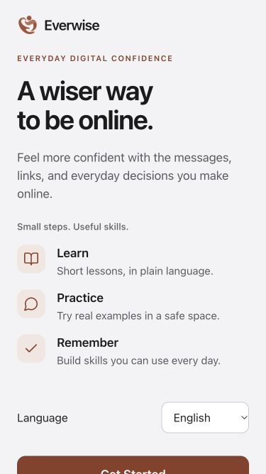
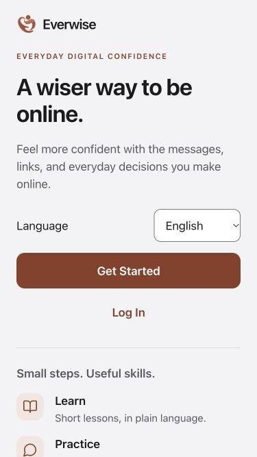
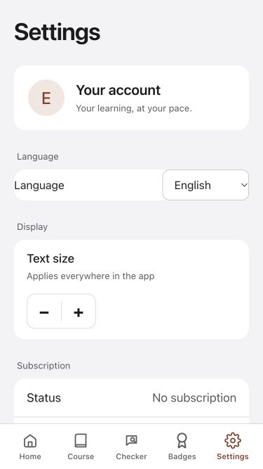
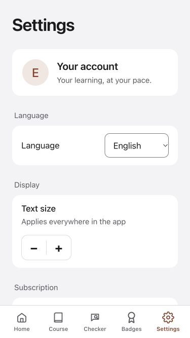

# Readable, consistent web screens — 5 October 2026

This pass implements visible web changes for adults aged 60–80. It covers Welcome, Home, Badges, Settings, Login spacing, subscription supporting text, and the shared tablet sidebar. The Swift application is a separate checkout; this is not a new native release.

## Changes and rationale

- Welcome now places language, Get Started and Log In before the explanatory guide, in natural reading and keyboard order. Both actions fit in the initial 375 × 667 English view. The headline wraps naturally; tablet layouts pair the entry flow with a simple explanation column.
- Home uses a quieter 16-pixel card radius without a shadow, 17-pixel lesson descriptions, and 15-pixel secondary labels instead of 13. These values scale with the user's reading preference.
- Settings uses consistent 24-pixel phone margins, inset language controls, more readable supporting text and a vertically arranged profile at enlarged text sizes. Login separates the language control from account fields.
- Badges uses 48-pixel minimum filter heights and 17-pixel labels. At large phone text sizes the filters stack so Spanish words remain whole. The empty message is no longer another card. Tablet margins align with the surrounding screens.
- Badge interface labels, counts, filters, status and exam captions are translated. Saved badge names, curriculum titles and earned-award matching remain canonical English; those text runs have English language markup and Spanish users see a brief notice. Existing exam honors stay visible.
- The Spanish compact checker tab reads “Estafas”; its accessible name remains “Detector de estafas”. This prevents labels crowding on the narrowest reviewed screen. The text-size group label now translates as well.
- A cascade conflict allowed older beige/sidebar styles and 18-pixel navigation text to override the newer design. Scoped sidebar rules now render the intended neutral surfaces and 17-pixel navigation type.
- Subscription benefits and legal links use 15-pixel supporting text instead of 13. Renewal/payment disclosure remains at 18 pixels. Pricing, trials, billing logic, curriculum order, scoring and the connected learning path were not changed.

## Rendered evidence

Images are real browser captures, not concept illustrations. Welcome and entry navigation were exercised in the actual anonymous app. Authenticated screens use the existing isolated fixtures with synthetic data and disabled transaction callbacks.

| Welcome before | Welcome after |
| --- | --- |
|  |  |

| Settings before | Settings after |
| --- | --- |
|  |  |

Capture hashes and dimensions are in `web-consistency-2026-10-05/screenshots.json`. The full local gallery, including Home, Badges, tablet layouts and maximum Spanish reading size, is under `research/native-redesign-2026-10-05/web-consistency/` in the parent workspace.

## Validation

- 87 focused UI tests passed across achievements, Spanish, billing/paywall, Settings, Home and app navigation. Two added tests verify that translation preserves stored badge identities, earned counts, phase expansion and the empty state.
- Production web build passed. Existing large-bundle and ineffective dynamic-import warnings remain.
- Focused source lint and `git diff --check` passed.
- Visually reviewed 375 × 667 phone screens, 320 × 568 at reading size 10 in Spanish, and 1024 × 768 tablet screens. DOM measurements for the checked narrow Home/Settings/Welcome and normal tablet Home/Badges/Settings found no horizontal overflow. Subscription fixture measurements found no text overflow and a reachable footer at maximum Spanish size and normal tablet size.
- At maximum Spanish size, exercised Earned → All filters and confirmed the first phase stays expanded. Actual welcome actions opened onboarding and login without creating an account.
- The first large-text review exposed broken filter words and a squeezed profile. Both were adjusted and recaptured. The tablet review exposed the sidebar cascade conflict; its final rendered background and 17-pixel labels were read back.

These are targeted browser and component checks, not a complete device/accessibility certification. No real account, subscription or user progress was changed.

## Design reference and remaining acceptance

Apple's [UI Design Dos and Don’ts](https://developer.apple.com/design/tips/) informs the alignment, touch targets, contrast and avoidance of horizontal scrolling. The enlarged supporting sizes are EverWise's design choice for its older audience, not an Apple requirement or certification.

Older physical iOS/Safari versions, real VoiceOver usability, the complete Spanish curriculum, production account/purchase flows, native release configuration and cold-start performance still require acceptance. The current web bundle size remains a performance concern. This change is not a publisher handoff or App Store submission.
