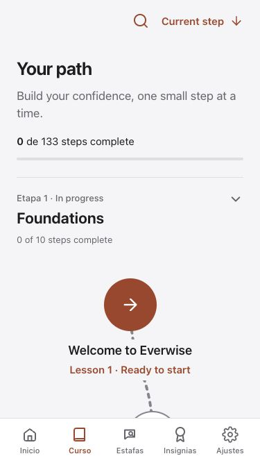
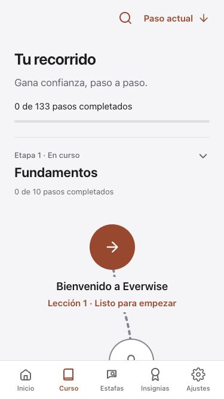
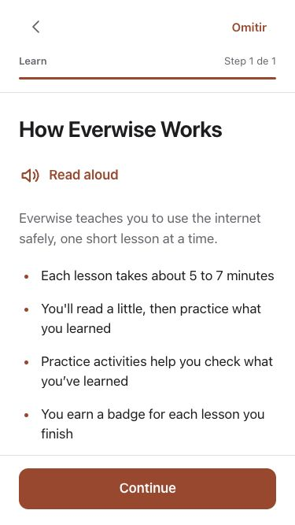
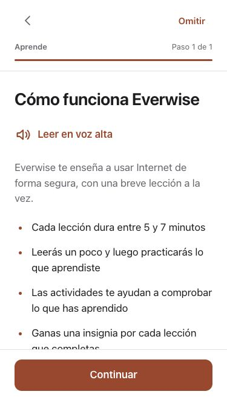
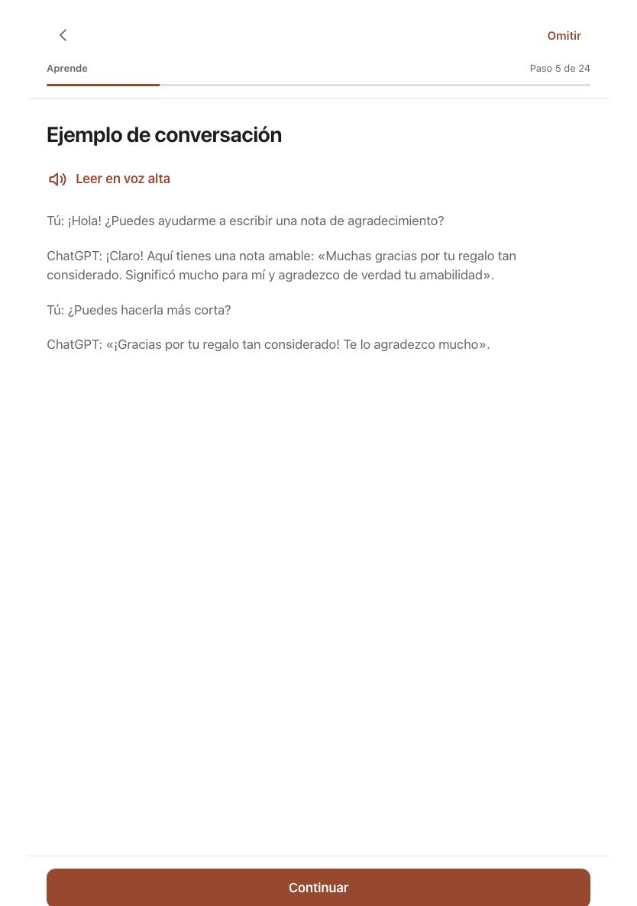
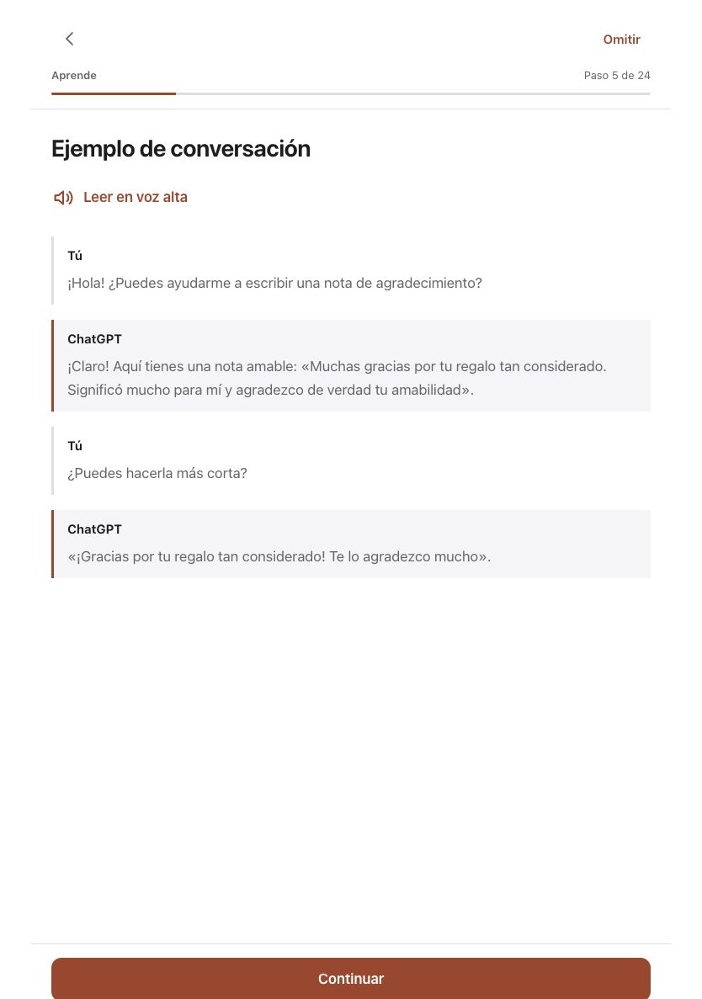

# Spanish learning and clearer conversations

October 5, 2026. Development changes for EverWise's 60–80-year-old audience.

Choosing Spanish previously left the path, lessons, feedback and summaries mostly in English. The nine Foundations lessons and their final challenge now use Spanish throughout the learning flow. Home's next-step title, phase headings, path search, completed/current/locked states, quiz review, flashcards, sentence activities and completion actions use consistent language. Search matches both original and translated titles, including queries without accents.

The ChatGPT example now separates each speaker's turn with a name, restrained background emphasis and consistent reading text. It preserves every sentence and the original reading order. An unfamiliar format falls back to ordinary paragraphs. Completion summaries avoid repeating the same heading as an eyebrow.

Apple's [localization guidance](https://developer.apple.com/documentation/xcode/localization) calls for checking that interfaces adapt to translated text. Its [inclusion guidance](https://developer.apple.com/design/human-interface-guidelines/inclusion) supports language choices and accessibility needs. These changes apply those principles; they are not Apple certification.

## Content and behavior

- The deferred dictionary contains 922 entries: 881 unique Foundations display strings and 41 contextual sentence forms. 877 entries match the existing native Spanish catalog exactly; 43 cover differing web wording, and two align phase/challenge terminology. The [bilingual review CSV](2026-10-05-web-spanish-review.csv) records the source of every entry. Independent bilingual editorial review remains open.
- Localization occurs at presentation. Canonical curriculum files, answer values, assessment revisions, indices, IDs and stored progress are unchanged. Switching language preserves current selections.
- Fill-in sentences translate the template before inserting the contextual answer. Incorrect responses still display the correct sentence and the applicable explanation. Narration receives translated fields before they are joined; device speech requests Spanish when selected. Actual audio quality/provider acceptance is not established by the mocked audio checks.
- Settings and later-phase notices state the translation boundary. Later lessons, some award names and AI results remain in English. This increment does not claim complete Spanish support across all 17 phases.

## Rendered comparisons

The captures use the actual built web components with test callbacks and sample progress. They do not make purchases or modify an account. [Capture hashes and provenance](evidence/web-spanish-foundations/manifest.json) distinguish the three comparison baselines.

| Screen | Before | After |
| --- | --- | --- |
| Connected path, Spanish, 375 × 667 |  |  |
| Welcome lesson, Spanish, 375 × 667 |  |  |
| Conversation, Spanish, 834 × 1187 capture |  |  |

Maximum reading size: [320 × 568 path](evidence/web-spanish-foundations/phone-path-maximum.jpg) and [tablet flashcard](evidence/web-spanish-foundations/tablet-flashcard-maximum.jpg). The complete local gallery additionally includes all nine opening screens, correct/incorrect feedback, narrow search, the enlarged conversation and challenge completion.

## Final validation

- **2,247 UI/component tests passed across 37 Vitest files.** Coverage includes all 881 display keys, sentence placeholders, distinct translated answer labels, selection persistence across locale changes, canonical quiz scoring, challenge completion, conversation order, bilingual path search and translated narration payloads.
- **469 non-browser Node tests passed.** The separate shell-driven paywall browser test was excluded; this is not a claim that the aggregate `npm test` command passed.
- Production build, lint and whitespace checks passed. Existing large-entry-chunk and ineffective-dynamic-import warnings remain.
- Browser review checked all nine Spanish opening screens at 375 × 812. Representative activities used 375 × 667, a 320 × 568 path/search layout, a tablet portrait view and a 1024 × 768 landscape view. Largest app text was checked on the narrow path, fill-in correction, conversation and tablet flashcards. Selected narrow layouts had no horizontal document overflow, and next actions remained reachable.
- The actual final challenge was walked through its five activity types, all three review cards, feedback, completion and return callback. Browser fixtures verify components and interactions, not production account persistence or physical-device behavior.

The course dictionary stays outside the startup bundle and loads with activity players. Built startup JavaScript is 1,037,063 bytes (305,609 estimated gzip), compared with 1,029,608 bytes (303,125 gzip) before this increment. The first lesson's additional download is 203,500 bytes (59,440 gzip), including Spanish resources for either selected language; before localization it was 104,213 bytes (28,384 gzip). This is a deliberate translation cost, still below the former full-course download of 950,389 bytes. These are static file measurements, not network or device timing.

Raw logs, the built manifest, bundle calculations and the full gallery remain in the workspace at `research/native-redesign-2026-10-05/web-spanish-foundations/`.

## Release boundary

This changes the web client and its shared component code. It does not alter or rebuild the Swift app, change deployment targets, submit an App Store update, or send files to a publisher. Later-course translation, actual VoiceOver/audio usability, older physical devices, production services, StoreKit/TestFlight purchase and upgrade acceptance remain separate release work.
