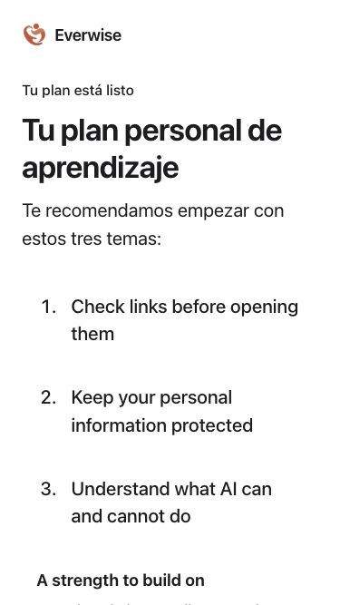
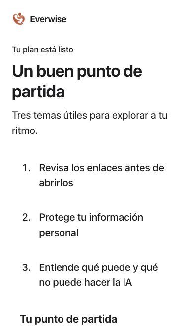

# A clearer personal plan — October 6, 2026

The Spanish plan previously mixed translated headings with English recommendations and strengths. It now translates every authored recommendation and supporting paragraph, introduces the plan with “A good place to start” to match native iOS, and gives the supporting section a readable 18 px heading and 17 px body before the user’s text scale.

Missing interview answers now receive introductory safety and AI guidance; an unanswered question no longer implies prior AI use or a scam incident. Canonical interview values, subscription routing and existing translations are preserved. Seventeen Spanish interface entries were added. Independent bilingual review remains open.

## Rendered comparison

| Before | After |
| --- | --- |
|  |  |

[Maximum phone text](personal-plan/web-phone-max-action.png) · [iPad](personal-plan/web-ipad-after.png) · [Maximum iPad text](personal-plan/web-ipad-max-action.png)

## Verification

- 23 focused status-screen tests passed; the final full component run passed all **2,355 tests in 37 files**.
- Added checks cover all six concern branches, three prior-experience variants, incomplete interviews, live language switching and continuation callbacks.
- Final lint and production build passed. The existing bundle-size and ineffective-dynamic-import warnings remain; this increment does not claim a bundle performance improvement.
- Actual `PersonalPlan` production component and application styles were reviewed in a local harness at 375 × 667 and 834 × 1112, using app text sizes 4 and 10. The translated text reflows without horizontal overflow and the Continue action works at ordinary and enlarged sizes. The harness uses a synthetic profile and local callback, not deployed account or billing services.
- Existing Spanish values were compared structurally and are unchanged. Node service checks were not rerun because this increment changes a presentation component and its local recommendation defaults.

The brief continues to prioritize adults aged 60–80: calm language, clear hierarchy, readable supporting text and a reachable primary action. Native startup work is documented separately in the Swift repository. No deployment, publisher message or App Store submission occurred.
