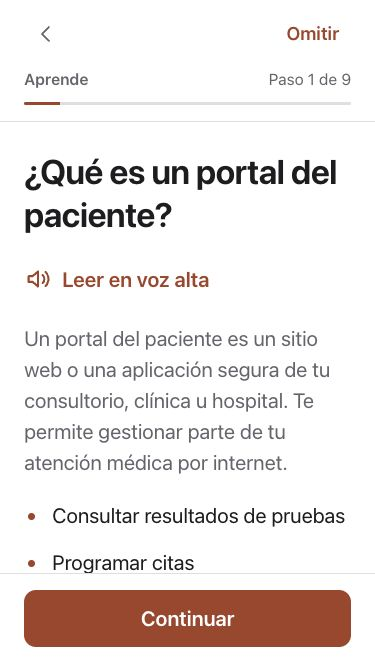
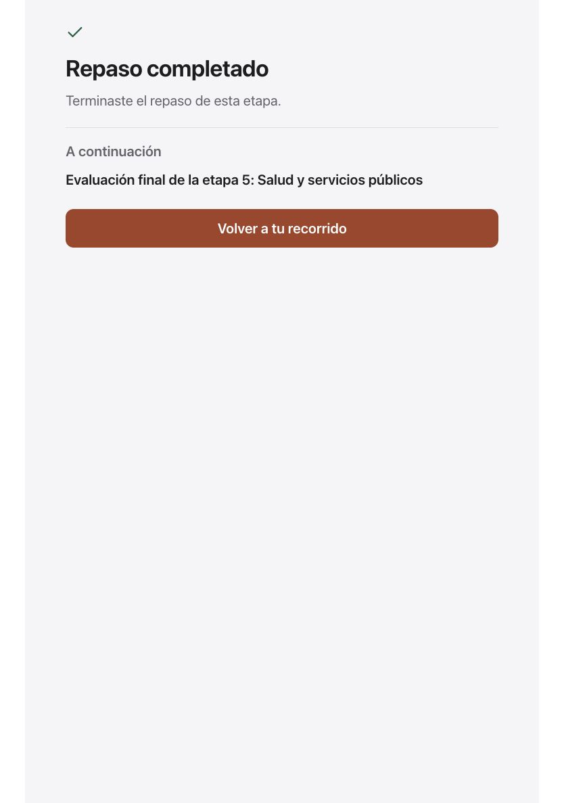

# Health and Government in Spanish — October 6, 2026

The Health and Government stage is now available in Spanish across patient portals, consultations at a distance, prescription scams, Medicare, IRS, motor-vehicle services and government websites, including the final challenge. This adds **688 catalog entries per app**: 669 new display strings and 19 contextual sentence words. Existing translations are unchanged. Canonical lesson IDs, ordering, answer values and progress structures are preserved.

The translation uses short, direct language and the existing adjustable typography and reading controls. “Consultas médicas a distancia” is used instead of unfamiliar telehealth jargon. Contextual answers produce complete grammatical sentences, while scoring retains the English canonical values. The language selector now accurately describes coverage through Health and Government; later lessons and AI results remain identified as English.

## Nine source corrections

Nine English strings were corrected in both apps. Patient portals may be available at any hour, but messages are not necessarily read immediately; urgent concerns should not wait for a portal reply. See [MedlinePlus patient portals](https://medlineplus.gov/ency/patientinstructions/000880.htm).

Online-pharmacy guidance now includes a valid prescription, licensed pharmacist, US address/phone and state-board verification. One warning sign is enough to pause, rather than waiting for several. See [FDA buying medicines safely](https://www.fda.gov/consumers/consumer-updates/how-buy-medicines-safely-online-pharmacy) and [BeSafeRx](https://www.fda.gov/drugs/besaferx-your-source-online-pharmacy-information/about-besaferx).

Government guidance checks the actual website name, not a logo or “.gov” appearing anywhere in a link. It explains that `irs.gov.example.com` is not `irs.gov`, and allows verified state/local services using other addresses. Motor-vehicle agency names and responsibilities differ by state; learners are directed to an official directory. See [CISA .gov eligibility](https://get.gov/domains/eligibility/) and [USA.gov state motor-vehicle services](https://www.usa.gov/state-motor-vehicle-services).

Telehealth copy distinguishes unexpected payment demands from a legitimate appointment copay and advises verification through a known provider number. See [HHS telehealth costs](https://telehealth.hhs.gov/patients/how-do-i-pay-telehealth). A malformed fill-in sentence now reads “Check that you are on the official ______ before entering personal information.” Its canonical answer remains `Website`; Spanish correctly inserts “sitio web”.

The review CSV records source keys, translations and locations. Independent bilingual approval is still required; these translations have received implementation/content review, not that independent acceptance.

## Web verification

- **2,392 component tests passed across 37 files**, followed by lint and production build. Existing React-hook dependency and bundle-size warnings remain.
- New checks cover **732 normalized display keys** across seven lessons and the final challenge, all seven reading/completion views, sentence choices/scoring for all eight items, and the final assessment handoff.
- Actual AppShell and learning components were reviewed at **375×667** and **834×1210**. Phone practice used maximum in-app text; the three portal answers scored correctly and continued to the scenario. After matching the harness to the actual AppShell, the maximum-text first answer and progression were rechecked. Tablet review completed all five challenge activities and displayed the Spanish assessment handoff.
- Previous translations, canonical lesson IDs, answer indices/values and progress structures are unchanged. Only the nine documented English source strings change.
- Native companion: 392 Unit-plan checks, three focused UI methods per phone/iPad and a Release simulator build passed. Both native test devices run iOS 27; older-runtime acceptance remains open.

These use synthetic progress/local callbacks and do not establish production account persistence, cloud CI or App Store acceptance. No Node service-suite or full responsive-navigation rerun was required for this content-only increment.

## Captures

Unmodified screenshots and SHA-256 records are in `evidence/spanish-health-government/`. The translation review CSV is `../localization/spanish-health-government-review.csv`; full local logs/gallery are in the parent workspace at `research/native-redesign-2026-10-06/spanish-health-government/`.

Later-course Spanish, independent bilingual review, real speech/VoiceOver, physical devices and production release gates remain open. No merge, deployment, publisher message or App Store submission is included.
