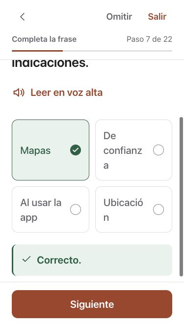
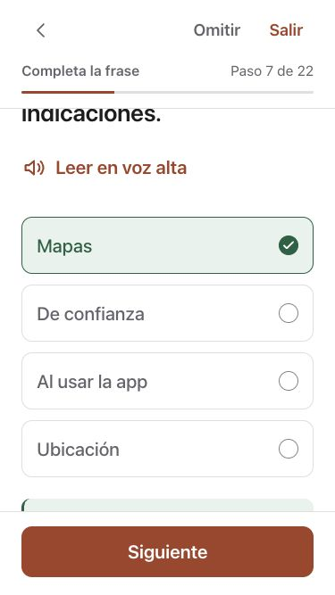

# Spanish Safe Internet Habits and readable answer choices

All nine Safe Internet Habits lessons and their final challenge now have Spanish reading, practice, quiz and completion copy. The learning dictionary adds 717 entries without modifying existing entries. Contextual fill-in forms preserve product names and Spanish grammar. Settings and the learning path now state that Foundations and Safe Internet Habits are translated; later lessons remain identified as English.

On a 375-point phone, the previous two-column answer grid broke “confianza” and “ubicación” into fragments. Minimum choice width now scales with the text preference and collapses to readable full-width rows when space is limited. Tablet choices retain the responsive grid where room permits.

| Before, size 4 | After, size 4 |
| --- | --- |
|  |  |

[Maximum size 10](evidence/spanish-safe-internet/web-phone-location-max.png) and [tablet browser-warning question](evidence/spanish-safe-internet/web-tablet-browser.png). These are actual component fixtures with isolated callbacks, not production accounts.

Connection-security copy now separates encryption from trust, avoids assuming every browser shows a padlock and advises stopping at security warnings. Permission instructions allow declining unnecessary access and explain active background navigation. References: [Apple Safari](https://support.apple.com/en-us/102279), [Apple location permissions](https://support.apple.com/en-us/102515), [Chrome](https://support.google.com/chrome/answer/95617?hl=en), [FTC public Wi-Fi](https://consumer.ftc.gov/articles/are-public-wi-fi-networks-safe-what-you-need-know). Lesson IDs, ordering, answer indices and scoring are retained; English display copy deliberately changes in the reviewed Phase 2 explanations and HTTPS quiz.

2,327 component checks passed across 37 files after the final JavaScript changes. The final CSS adjustment was then inspected at 375 × 667 and 834 × 1210, at text sizes 4 and 10. Browser interaction completed all three location answers and confirmed the browser-warning answer feedback. Final lint and production build passed. Existing large-bundle and ineffective-import warnings remain. The previous non-browser checks were not repeated; no full browser/paywall acceptance is claimed.

Native companion coverage includes 376 Unit checks, three UI methods on each phone/iPad simulator, 26 visually inspected screenshots and a Release simulator build retaining the iOS 15 minimum. See the Swift repository's `docs/localization/spanish-safe-internet.md` and bilingual review sheet. Later-course Spanish, independent bilingual review, older physical devices, audio/VoiceOver, performance and production release acceptance remain open. No deployment or publication occurred.
